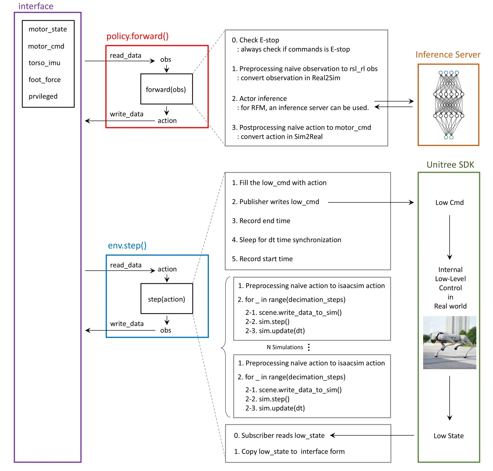

# Isaac RL: Quadruped & Humanoid Robot Learning

[](https://docs.isaacsim.omniverse.nvidia.com/latest/index.html)
[](https://docs.python.org/3/whatsnew/3.10.html)
[](https://opensource.org/licenses/BSD-3-Clause)

> GPU-accelerated reinforcement learning environments for Unitree GO2 quadruped locomotion
> and G1 humanoid loco-manipulation, built on [NVIDIA Isaac Lab](https://isaac-sim.github.io/IsaacLab).

This repository contains custom RL environments and training pipelines for two Unitree robots:
the **GO2 quadruped** (12 DOF) and the **G1 humanoid** (29 DOF). The GO2 work was developed
during a **Robotics Engineer Internship at [Sequor Robotics](https://sequor.ai)** as demonstration
RL policies for the company's Sim-to-Real deployment pipeline. The G1 humanoid work extends
this foundation to bipedal loco-manipulation and whole-body control.

### Note on Scope

The RL environments and methodologies presented here represent the **publicly shareable portion**
of the internship work. The proprietary **Sim-to-Real deployment pipeline and infrastructure
remain confidential** and are not included in this repository, as they constitute Sequor Robotics'
intellectual property. However, the overall Sim-to-Real architecture that I designed is shared
below to illustrate the full system context.

---

## Demo

### GO2 Recovery Task

<table>
<tr>
<td width="50%" align="center">
<h4>Simulation</h4>

</td>
<td width="50%" align="center">
<h4>Real Robot</h4>

</td>
</tr>
</table>

### GO2 Velocity Tracking Task

<table>
<tr>
<td width="50%" align="center">
<h4>Simulation</h4>

</td>
<td width="50%" align="center">
<h4>Real Robot</h4>

</td>
</tr>
</table>

---

## Results

### Simulation Performance
- **Recovery Task**: 95%+ success rate within 5 seconds
- **Velocity Tracking**: <0.1 m/s average tracking error

### Sim-to-Real Transfer
- **Performance Retention**: >90% of simulation performance maintained on real hardware
- **Robustness**: Successful deployment across various indoor/outdoor environments
- **Hardware**: Validated on Unitree Go2 Edu platform via Sequor Sim2Real Pipeline

---

## Sim-to-Real Architecture

While the deployment code is proprietary, the diagram below shows the overall system architecture
I designed for bridging simulation and real-robot execution. The key idea is a unified
**interface abstraction** that allows the same policy to run in both simulation (`env.step()`)
and on the real robot (`policy.forward()` with Unitree SDK), with Real2Sim/Sim2Real observation
and action conversions handled transparently.

<p align="center">

</p>

**Pipeline overview:**
- **`policy.forward()`** (deployment): Reads sensor data from the hardware interface, converts observations from Real2Sim format, runs actor inference (supports remote inference server for large models), and converts actions back to motor commands via Sim2Real postprocessing.
- **`env.step()`** (training): Runs N parallel physics simulations with decimation steps, matching the real-world control frequency for zero-gap transfer.
- **Unitree SDK integration**: Low-level commands are published to the robot via the Unitree SDK, with precise dt-synchronized control loops ensuring consistent policy behavior.

---

## Key Technical Contributions

### 1. Symmetry-Aware Data Augmentation

Quadruped and biped locomotion exhibit left-right symmetry. By mirroring observations and
actions along the sagittal plane, we effectively double the training data per environment
step. The symmetry transformation is implemented as index permutations on the observation
and action vectors, making it zero-cost at training time. This consistently accelerates
convergence by 30-50% across all locomotion tasks.

### 2. Two-Level Curriculum Learning

Training stable bipedal walking requires careful curriculum design. We use two complementary
curriculum mechanisms:

- **Command range expansion**: The velocity command distribution gradually widens from a
  narrow safe range to the full target range as the policy improves.
- **Adaptive reward weight scheduling**: Regularization rewards (energy, smoothness) start
  with high weight to stabilize early training, then decrease as task rewards (velocity
  tracking, manipulation) increase in importance.

### 3. Hybrid Control Architecture (G1 Whole-Body)

For the 29-DOF G1 humanoid, training a single monolithic policy for simultaneous locomotion
and manipulation is sample-inefficient. We decompose the problem:

- **Lower body (12 DOF)**: Trained with RL for robust bipedal locomotion
- **Upper body (14 DOF + hands)**: Controlled via inverse kinematics (IK) or imitation
  learning (IL) for precise end-effector positioning

This hybrid approach reduces the effective action space for RL by ~60%, dramatically
improving training stability and convergence speed.

### 4. Physics-Based Fall Recovery (GO2)

The GO2 recovery policy trains on physically realistic fallen poses generated by simulating
actual falls, rather than hand-crafted reset distributions. A multi-phase reward structure
guides the robot through: (1) limb retraction, (2) body rotation to prone/supine,
(3) push-up to standing. This produces robust recovery behaviors that transfer to the
real robot.

---

## Environments

| Environment ID | Robot | Task | DOF | Key Features |
|---|---|---|---|---|
| `Isaac-Velocity-Sequor-Unitree-Go2-v0` | GO2 | Velocity Tracking (Flat) | 12 | Symmetry augmentation, observation history, curriculum |
| `Isaac-Velocity-Sequor-Rough-Unitree-Go2-v0` | GO2 | Velocity Tracking (Rough) | 12 | Terrain curriculum, heightmap observations |
| `Isaac-Recovery-Sequor-Flat-Unitree-Go2-v0` | GO2 | Fall Recovery (Flat) | 12 | Physics-based reset, multi-phase reward |
| `Isaac-Recovery-Sequor-Rough-Unitree-Go2-v0` | GO2 | Fall Recovery (Rough) | 12 | Rough terrain recovery |
| `Isaac-LocoManip-G1-v0` | G1 | Loco-Manipulation | 29 | Two-level curriculum, biped walking + arm control |
| `Isaac-LocoManip-EE-G1-v0` | G1 | Loco-Manip + EE Tracking | 29 | End-effector position tracking reward |
| `Isaac-WholeBody-G1-UpperBodyIK-v0` | G1 | Whole-Body Control (IK) | 29 | RL lower body + IK upper body |
| `Isaac-WholeBody-G1-UpperBodyIL-v0` | G1 | Whole-Body Control (IL) | 29 | RL lower body + IL upper body |
| `Isaac-WholeBody-G1-FullRL-v0` | G1 | Whole-Body Control (Full RL) | 29 | Full 29-DOF RL baseline |

Each environment also provides a `-Play-v0` variant with reduced environment count for interactive evaluation.

---

## Project Structure

```
quad_humanoid_envs/
├── __init__.py                 # Package root (triggers gym registration)
├── go2/                        # Unitree GO2 Quadruped (12 DOF)
│   ├── velocity/               # Velocity tracking (flat + rough terrain)
│   │   ├── env_cfg.py          # Environment configuration
│   │   ├── mdp.py              # Custom reward / observation / curriculum terms
│   │   └── agents/             # PPO hyperparameters, symmetry augmentation
│   └── recovery/               # Fall recovery policy
│       ├── env_cfg.py
│       ├── mdp.py
│       └── agents/
├── g1/                         # Unitree G1 Humanoid (29 DOF)
│   ├── locomanip/              # Locomotion + manipulation
│   │   ├── env_cfg.py          # Base environment (+ EE tracking variant)
│   │   ├── mdp.py              # Loco-manipulation rewards & observations
│   │   ├── robots.py           # G1 29-DOF articulation configs
│   │   └── agents/             # PPO configs, symmetry indices
│   └── wholebody/              # Whole-body control
│       ├── env_cfg.py          # UpperBodyIK / UpperBodyIL / FullRL variants
│       ├── actions.py          # Hybrid action space (RL + IK/IL)
│       ├── agents/
│       └── controllers/        # IK and IL upper-body controllers
│           ├── ik_controller.py
│           └── il_controller.py
scripts/
├── train.py                    # Training entry point (RSL-RL wrapper)
└── play.py                     # Evaluation entry point
```

---

## Installation

### Prerequisites

- **NVIDIA Isaac Sim 4.5** ([installation guide](https://docs.isaacsim.omniverse.nvidia.com/latest/installation/install_workstation.html))
- **Isaac Lab 2.1.1+** ([installation guide](https://isaac-sim.github.io/IsaacLab/main/source/setup/installation/index.html))
- **Python 3.10+**
- **CUDA 12.1+**
- **NVIDIA GPU** with recent drivers (tested on RTX 5070 Ti, driver 580+)

### Setup

```bash
# 1. Install Isaac Lab (follow official docs)
#    https://isaac-sim.github.io/IsaacLab

# 2. Clone and install this package
git clone https://github.com/erickun0125/isaac-rl-quad-humanoid.git
cd isaac-rl-quad-humanoid
pip install -e .

# 3. Verify installation
python -c "import quad_humanoid_envs; print('Installation OK')"
```

---

## Training

```bash
# GO2 Velocity Tracking (Flat Terrain, 4096 parallel envs)
python scripts/train.py --task Isaac-Velocity-Sequor-Unitree-Go2-v0 --num_envs 4096

# GO2 Velocity Tracking (Rough Terrain)
python scripts/train.py --task Isaac-Velocity-Sequor-Rough-Unitree-Go2-v0 --num_envs 4096

# GO2 Fall Recovery
python scripts/train.py --task Isaac-Recovery-Sequor-Flat-Unitree-Go2-v0 --num_envs 4096

# G1 Loco-Manipulation
python scripts/train.py --task Isaac-LocoManip-G1-v0 --num_envs 4096

# G1 Loco-Manipulation with End-Effector Tracking
python scripts/train.py --task Isaac-LocoManip-EE-G1-v0 --num_envs 4096

# G1 Whole-Body Control (Upper Body IK)
python scripts/train.py --task Isaac-WholeBody-G1-UpperBodyIK-v0 --num_envs 4096

# Resume training from checkpoint
python scripts/train.py --task Isaac-LocoManip-G1-v0 --resume --load_run <run_dir>
```

Training logs are saved to `logs/rsl_rl/<experiment_name>/` with TensorBoard summaries,
config snapshots, and model checkpoints.

---

## Evaluation

```bash
# Play a trained policy
python scripts/play.py --task Isaac-LocoManip-G1-Play-v0 --load_run <run_dir>

# Play with video recording
python scripts/play.py --task Isaac-WholeBody-G1-UpperBodyIK-Play-v0 \
    --load_run <run_dir> --video --video_length 500

# Real-time playback
python scripts/play.py --task Isaac-Velocity-Sequor-Unitree-Go2-Play-v0 \
    --load_run <run_dir> --real-time
```

The play script automatically exports the trained policy to JIT and ONNX formats
in `<checkpoint_dir>/exported/` for deployment on the real robot.

---

## Tech Stack

| Component | Technology |
|---|---|
| Simulation | NVIDIA Isaac Sim 4.5 |
| RL Framework | Isaac Lab 2.1.1 |
| RL Algorithm | PPO ([RSL-RL](https://github.com/leggedrobotics/rsl_rl)) |
| Neural Network | PyTorch 2.5+ |
| Environment API | Gymnasium 0.29+ |
| Deployment | Unitree SDK (Go2 Edu) |
| Language | Python 3.10 |
| GPU | NVIDIA RTX (tested on RTX 5070 Ti) |

---

## Citation

```bibtex
@misc{isaac_rl_quad_humanoid,
  title={Isaac RL: Quadruped & Humanoid Robot Learning},
  author={Kyungseo Park},
  year={2025},
  note={Custom RL environments for Unitree GO2 and G1 robots}
}
```

---

## License

This project is released under the [BSD-3-Clause License](LICENSE).

---

**Contact**: erickun0125@snu.ac.kr
**Hardware Platform**: Unitree Go2 Edu, Unitree G1
**Base Framework**: [NVIDIA Isaac Lab](https://isaac-sim.github.io/IsaacLab)
